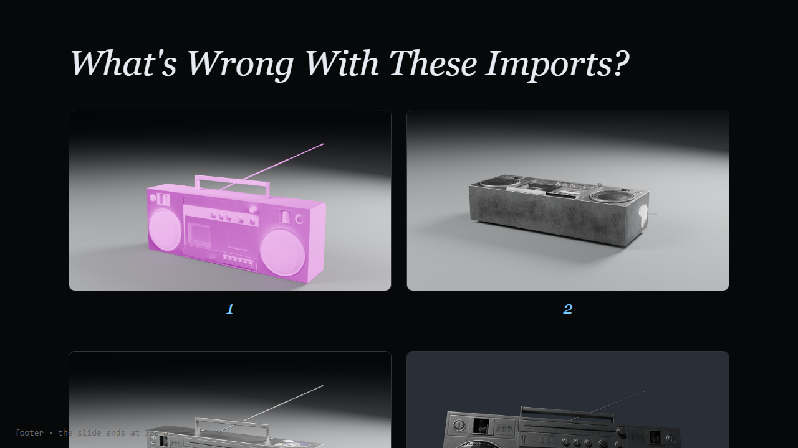
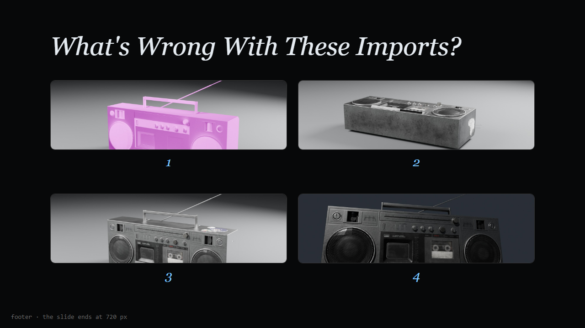

# Gallery fit: galleries must stay on the slide

Tasks #52–#56 in `TASKS.md`. Written 2026-09-25 from a failure in a real lecture deck.

**Status: done.** All five tasks shipped on 2026-09-25 (#52 `1639643`, #56 `235419e`,
#53 `7f542b2`, #54 `f54332b`, #55 `a61090b`); see `CHANGELOG.md`. This file stays as
the record of why the gallery works the way it does.

## The bug

A gallery with more than one row of landscape pictures runs off the bottom of the
slide. Some single rows do too. Nothing clips or warns; the second row simply
continues below the stage.

**Real repros** (lecture content, outside the repo):

| Deck | Slide | Gallery | Needs | Has |
|---|---|---|---|---|
| `S1_3D Design Foundations/Week 01 - Coordinate Systems & The USD Pipeline.dek` | 63 | 4 × 1600×900, `columns: 2`, labels "1"–"4" | ~750 px | 474 px |
| same deck | 6, 75 | 4 landscape pictures in 2 rows | ~650–750 px | 474 px |
| `S1_Design & Gestalt/Week 03 - Figure-Ground & Negative Space.dek` | 55 | 3 × 600×840 portraits, `columns: 3`, labelled | ~544 px | 474 px |

(All under `D:\Google Drive\THRO\Lectures\`.)

**Minimal repro** for the dev server: any four 16:9 images.

```yaml
layout: gallery
title: What's Wrong With These Imports?
columns: 2
items:
  - { image: Assets/a.png, label: "1" }
  - { image: Assets/b.png, label: "2" }
  - { image: Assets/c.png, label: "3" }
  - { image: Assets/d.png, label: "4" }
```



## Root cause

`src/styles/slide.css`, `.gallery-grid`, sets `grid-template-columns`
(`SlideView.vue` passes `repeat(cols, 1fr)`) but no rows. Rows are therefore
implicit `auto` tracks, sized by their content:

- `.gallery-cell` is a flex column.
- `.frame` has `flex: 1`, but inside an auto-height row that resolves to its
  content.
- `FramedImage` renders the `` at `width: 100%; height: 100%`. With no
  definite height above it, the image falls back to its natural aspect at column
  width.

So every row is as tall as its tallest picture at column width, plus the 62 px
label box and the 10 px gap. `height: 100%` on the grid doesn't help, because it
limits the grid container, not its implicit rows.

**The two render paths disagree.** `bake.ts` (`case 'gallery'`, used by
bake-to-freeform and by PowerPoint export) already fits the gallery to the
stage: `cellH = (gridH - GAP * (rows - 1)) / rows`. So a deck overflows live but
fits in `.pptx` and after baking. The constants differ too:

| | `slide.css` (live) | `bake.ts` |
|---|---|---|
| Title box | 78 px + 28 | `H1_H` ≈ 67 + 28 |
| Label | 62 px box + 10 gap | 28 × 1.2 + 10 = 43.6 |
| Row height | natural image height | equal share of the stage |

## #52: rows share the available height (easy, fixes every repro)

In `SlideView.vue`:

- Compute `galleryRows = ceil(items / cols)`.
- Add `gridTemplateRows: repeat(${galleryRows}, minmax(0, 1fr))` next to the
  existing `gridTemplateColumns`.

In `slide.css`:

- Add `min-height: 0` to `.gallery-cell`.
- Make sure the `FramedImage` root fills the frame (`.fi` already has
  `height: 100%`).
- Take the label height from one shared value, and make bake's `labelH` use the
  same value. 44 px is enough: the label is `FittedText` and shrinks anyway. That
  saves 28 px per row.
- Align the title height between the two paths in the same way.

Result: a gallery can no longer leave the stage, and live matches bake and
`.pptx` again. Verified in an HTML replica of the gallery DOM and CSS:



**Side effect, and the reason for #53:** with rows limited, `object-fit: cover`
crops hard. In the replica the four renders become 518×150 strips, which cuts off
exactly the detail the students are asked to judge.

## #53: gallery `imageFit` and frames that hug the picture (medium)

- Add `imageFit: cover | contain` to the gallery layout. It is slide-level, with
  an optional per-item `fit` override. Validate it in `analyze.ts` (`fields`,
  `gallery`). Keep `cover` as the default, so existing decks look the same.
- In `contain` mode, the frame's border and radius should wrap the displayed
  picture, not the cell. Otherwise contain looks like letterbox bars inside a
  box. Centre an `` with `max-width: 100%; max-height: 100%; width: auto;
  height: auto`, and put the border and radius on the image itself.
- Bake: pass `fit` through to the baked image boxes (canvas boxes already take
  `fit`). Where natural sizes are known, shrink each baked box to the contained
  rectangle, so the stroke hugs the picture there too.
- Right-click: the per-cell image menu (see #45) gains Fit: Cover / Fit: Contain.

## #54: smarter `columns: auto` (medium)

Today `auto` means `min(n, 3)`, which ignores the pictures' shapes. Put a pure
function in a new `src/core/gallery.ts` and use it from both `SlideView.vue` and
`bake.ts`, so the two can't drift apart:

```ts
bestColumns(aspects: number[], box: { w: number; h: number }, gap: number, labelH: number): number
```

- For each c in 1..n: rows = ceil(n / c), and
  cell = ((box.w − gap·(c−1)) / c, (box.h − gap·(rows−1)) / rows − labelH).
- Fit each picture inside its cell ("contain" size) and score c by the
  *smallest* fitted picture.
- Return the best c; on a tie, take fewer rows.

Examples, with a 1060×474 box and 24 px gaps:

| Pictures | Labels | Best arrangement | Note |
|---|---|---|---|
| 4 × 16:9 | yes | 4 in one row | 2×2 only wins without labels |
| 3 portraits | yes | 3 in one row | they shrink to fit |
| 2 × 16:9 | — | 2 in one row | |

Natural sizes: `FramedImage.vue` already reads them (`readNatural`). Lift them
into a small cache or composable keyed by `src`, so the layout can compute before
paint and re-compute on load. Add unit tests for `bestColumns`, with the cases
above plus mixed aspects, n = 1 and n = 9.

## #55: gallery warnings in the Review panel (medium)

After #52 nothing can overflow any more, but a gallery can still fail in a
quieter way. `analyze.ts` warns only past six items today. Add, where natural
sizes are known:

- `warning`: a displayed picture smaller than about 250 × 140 stage px (too
  small to judge from the back of a lecture hall).
- `info`: `cover` crops more than about 35 % of any picture (suggest
  `imageFit: contain`).

Keep the existing ">6 items" info.

## #56: short labels as badges (easy, optional)

A label like "1", "A" or "B" still costs a full label row. Add
`labelPos: below | overlay` (default `below`). `overlay` draws the label as a
small badge in the frame's top-left corner: accent text on a dark translucent
pill. Bake draws it as a box over the image. Quiz galleries ("which one is real?")
get their whole height back.

## Done means

- No gallery renders outside the 1280×720 stage, for n ≤ 9 pictures, any
  `columns`, any aspect ratio, with and without title and labels.
- Live render, baked freeform and `.pptx` place cells within ±2 px of each other.
- `vitest` covers `bestColumns` and the bake geometry; `vue-tsc -b` is clean.
- `skills/dek/references/layouts.md`, gallery section: remove the "Rows are not
  shrunk to fit the slide" paragraph, and document `imageFit`, `labelPos` and the
  new `auto`.
- CHANGELOG entries.
- Tell the lecture-skill owner: `~/.claude/skills/lecturer/scripts/audit_deck.py`
  (`gallery_fit`) currently flags overflow. After #52 it should check picture
  size and crop instead.
